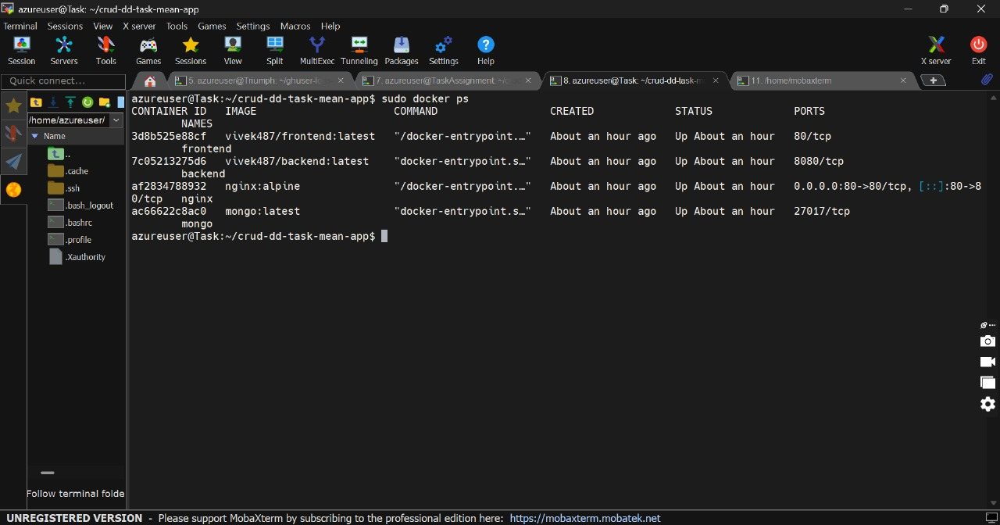
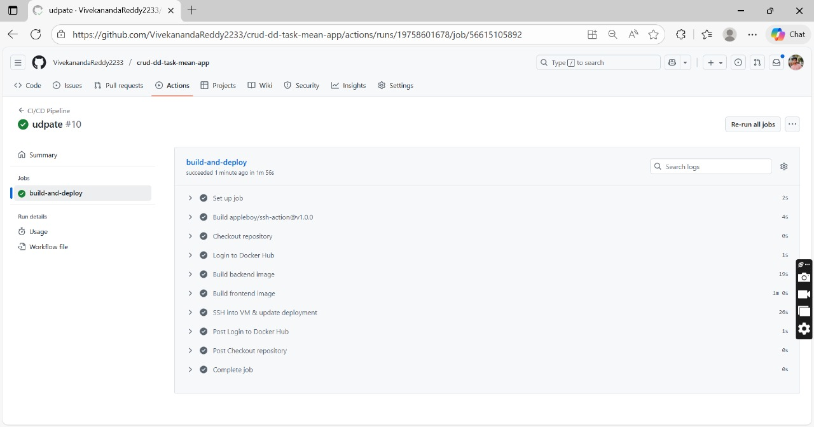
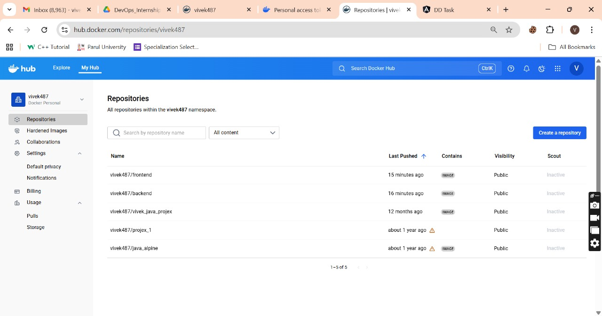
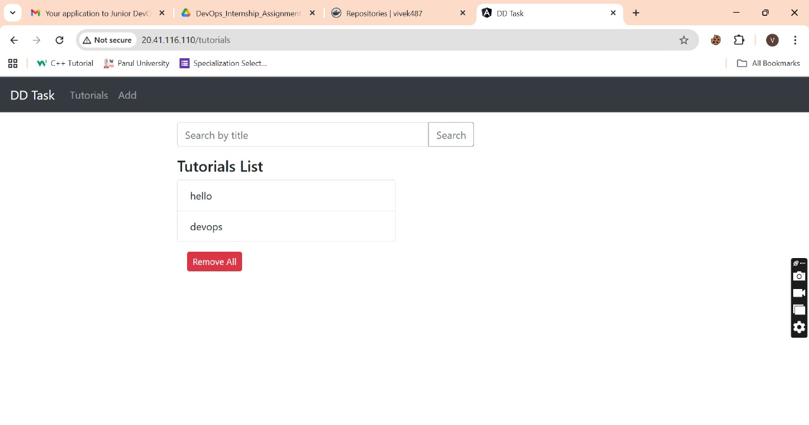
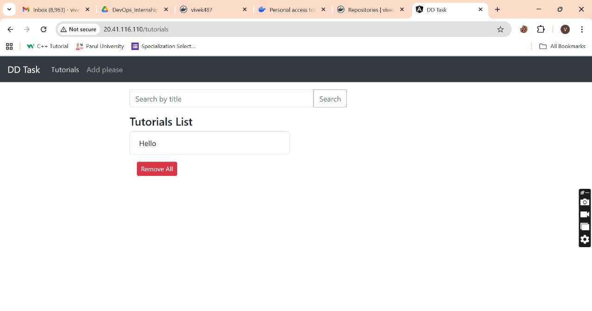
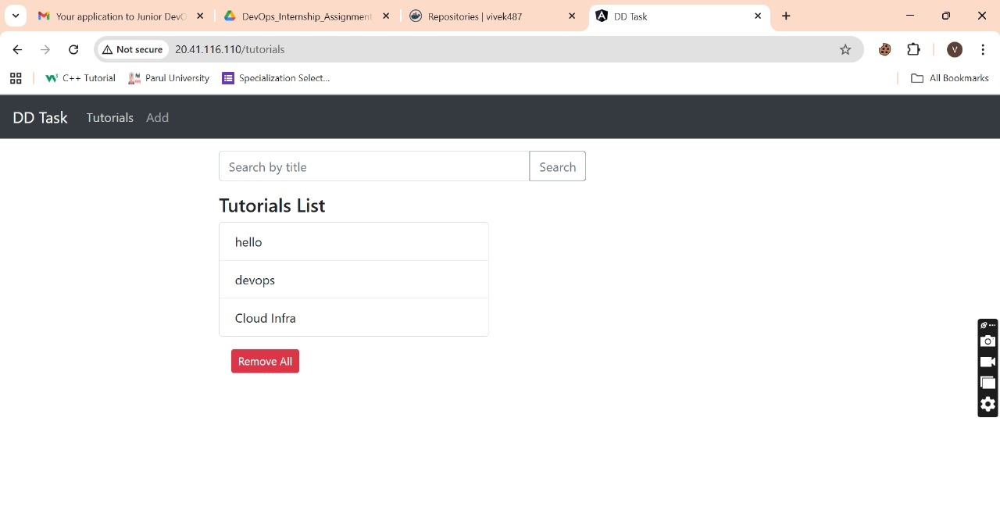
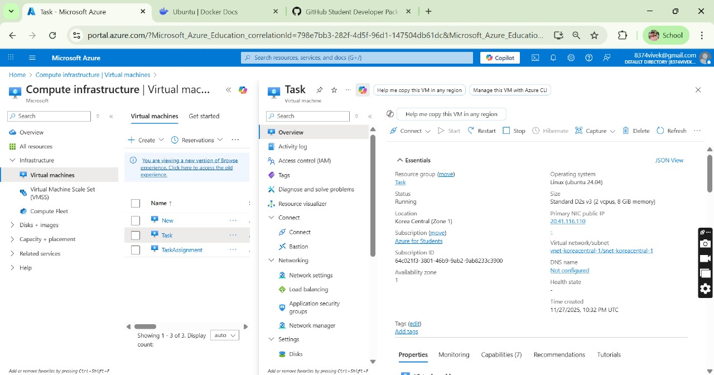

# CRUD DD Task - MEAN App (Containerized + CI/CD + Nginx)

This repository contains a **full MEAN-style CRUD application** (MongoDB, Express, AngularJS, Node.js) that is:

- Containerized with **Docker**
- Orchestrated using **Docker Compose**
- Fronted by **Nginx** reverse proxy (everything exposed on port **80**)
- Wired with a sample **GitHub Actions CI/CD pipeline** to:
  - Build Docker images for **frontend** and **backend**
  - Push them to **Docker Hub**
  - SSH into your Ubuntu VM and restart containers with `docker-compose`

> ⚠️ Note: This project is a clean sample implementation designed to match the task requirements.  
> You just need to plug in **your own values** (Docker Hub username, server IP, paths, etc.) and run.


## Live Application

🔗 **Working URL:**  
http://20.41.116.110

---

## 1. Project Structure

```bash
crud-dd-task-mean-app/
├─ backend/
│  ├─ src/
│  │  ├─ config/
│  │  │  └─ db.js
│  │  ├─ models/
│  │  │  └─ Item.js
│  │  └─ routes/
│  │     └─ items.js
│  ├─ server.js
│  ├─ package.json
│  ├─ Dockerfile
│  └─ .env.example
│
├─ frontend/
│  ├─ index.html
│  ├─ app.js
│  ├─ styles.css
│  └─ Dockerfile
│
├─ nginx/
│  └─ default.conf
│
├─ .github/
│  └─ workflows/
│     └─ deploy.yml
│
├─ docker-compose.yml
└─ README.md
```

---

## 2. Backend (Node.js + Express + MongoDB)

### 2.1. Features

- REST API for **Items**
- Endpoints:
  - `GET /api/items` – list all items
  - `POST /api/items` – create item
  - `PUT /api/items/:id` – update item
  - `DELETE /api/items/:id` – delete item
- Uses **MongoDB** via **Mongoose**
- CORS enabled for frontend

### 2.2. Local Backend Run (Without Docker)

```bash
cd backend
cp .env.example .env  # edit if needed
npm install
npm start
```

Default values (from `.env.example`):

```env
PORT=5000
MONGO_URI=mongodb://localhost:27017/cruddb
```

---

## 3. Frontend (AngularJS SPA)

> Note: This uses **AngularJS (1.x)** from CDN to keep the setup lightweight and still satisfy the MEAN stack requirement.

### 3.1. Features

- Simple UI to manage items:
  - List items
  - Add a new item
  - Edit existing item
  - Delete item
- Talks to backend via `/api/items` (Nginx will proxy).

No build step is required. It's just static files.

You can open `frontend/index.html` directly with a browser for quick testing (if backend is running and accessible).

---

## 4. Dockerization

### 4.1. Backend Dockerfile

Located at `backend/Dockerfile`.

- Uses `node:18-alpine`
- Installs dependencies
- Runs `server.js`

### 4.2. Frontend Dockerfile

Located at `frontend/Dockerfile`.

- Uses `node:16-alpine`
- Installs `http-server`
- Serves static AngularJS app on port `80` inside the container

### 4.3. MongoDB

Using official image: `mongo:latest` in `docker-compose.yml`.  
Database name: `cruddb`.

### Docker Images

---

## 5. Docker Compose + Nginx Reverse Proxy

`docker-compose.yml` orchestrates:

- `mongo` – MongoDB database
- `backend` – Node.js API
- `frontend` – static AngularJS app
- `nginx` – reverse proxy exposed on **host port 80**

### 5.1. Nginx Routing

- `http://<server-ip>/` → **frontend**
- `http://<server-ip>/api/...` → **backend**

`nginx/default.conf` defines this.

---

## 6. Running Everything With Docker Compose (Local or on VM)

### 6.1. Prerequisites on Ubuntu VM

Install:

```bash
# Docker
curl -fsSL https://get.docker.com -o get-docker.sh
sh get-docker.sh

# Docker Compose plugin (if needed)
sudo apt-get update
sudo apt-get install -y docker-compose-plugin

# Optional: allow current user to use Docker without sudo
sudo usermod -aG docker $USER
# Re-login after this
```

### 6.2. Clone the Repo on the VM

```bash
cd ~
git clone https://github.com/<your-username>/crud-dd-task-mean-app.git
cd crud-dd-task-mean-app
```

### 6.3. Create `.env` for Backend (Optional)

```bash
cd backend
cp .env.example .env
# For Docker, MONGO_URI is already passed via docker-compose, so this is optional.
cd ..
```

### 6.4. Run with Docker Compose

```bash
docker compose up -d
# or if using older docker-compose:
# docker-compose up -d --build
```

Then access the app in browser:

```text
http://<your-vm-public-ip>/
```

---


## 7. CI/CD with GitHub Actions

This repo includes:

```bash
.github/workflows/docker-cicd.yml
```

### 7.1. Pipeline Behavior

On `push` to `main` (you can change branch name):

1. **Build backend Docker image**
2. **Build frontend Docker image**
3. **Push both images to Docker Hub**
4. **SSH into your Ubuntu VM**
5. On the VM:
   - `cd` into the app directory
   - `git pull`
   - `docker compose pull`
   - `docker compose up -d `

### 7.2. Required GitHub Secrets

In your GitHub repo settings → **Secrets and variables → Actions**, add:

- `DOCKERHUB_USERNAME` – your Docker Hub username
- `DOCKERHUB_TOKEN` – a Docker Hub access token or password
- `VM_HOST` – your VM public IP / DNS
- `VM_USER` – SSH username (e.g., `ubuntu`)
- `VM_KEY` – contents of your private key (e.g., `~/.ssh/id_rsa`)
- `VM_APP_PATH` – path to your app on server (e.g., `/home/ubuntu/crud-dd-task-mean-app`)

---

## 8. Nginx Setup & Infrastructure

We are running **Nginx inside Docker** as part of `docker-compose.yml`.

- Nginx container listens on port `80`.
- Host maps `80:80`.
- Nginx:
  - sends `/api/...` to `backend:5000`
  - sends `/` to `frontend:80`.

If you want to use **host-level Nginx** instead of containerized one, you can:

1. Remove the `nginx` service from `docker-compose.yml`.
2. Install Nginx on the host:
   ```bash
   sudo apt-get install -y nginx
   ```
3. Put `nginx/default.conf` content into `/etc/nginx/sites-available/default`.
4. Update upstream URLs to point to `frontend` and `backend` containers via `localhost` ports.
5. Reload Nginx:
   ```bash
   sudo systemctl reload nginx
   ```

---

## 9. How to Build & Push Images Manually

Useful for debugging outside CI/CD.

```bash
# Backend
docker build -t <dockerhub-username>/crud-backend:latest ./backend
docker push <dockerhub-username>/crud-backend:latest

# Frontend
docker build -t <dockerhub-username>/crud-frontend:latest ./frontend
docker push <dockerhub-username>/crud-frontend:latest
```

Ensure `docker-compose.yml` uses the **same image names**.


---

## 10. Screenshots 

- **CI/CD configuration** – screenshot of `.github/workflows` in GitHub UI.
- **CI/CD run** – screenshot of a successful Actions run.
    

- **Docker images build & push** – screenshot of terminal or Docker Hub UI.
    

- **App working UI** – browser screenshot showing the CRUD interface.
      
      
      
- **Nginx & Infra** – diagram or screenshot showing services on your VM.
     

   


## 11. Notes

- Replace all placeholders like `<your-username>`, `<dockerhub-username>`, IPs, and paths with your own.
- Test locally with `docker compose up -d ` before wiring up CI/CD.
- This structure is ready to be pushed to **GitHub** and used directly.
